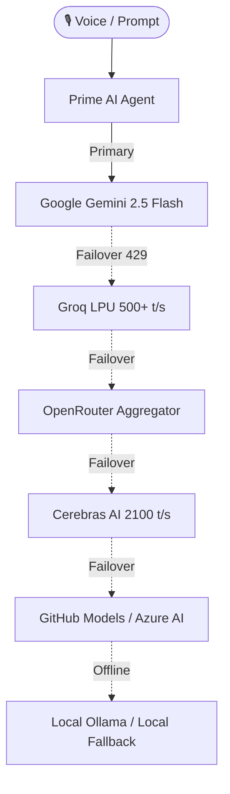

# ⚡ PRIME AI :: AUTONOMOUS NEURAL DESKTOP OPERATING SYSTEM
> **[ Zero GUI · 24/7 Hands-Free Ambient Voice · Deep OS Dominion · Multi-Brain Failover ]**  
> *Engineered for Pratik Thorat (`thoratpratik2323-hue`)*

[](https://microsoft.com)
[](https://python.org)
[](https://aistudio.google.com)
[](https://groq.com)
[](https://openrouter.ai)
[](https://github.com/thoratpratik2323-hue/prime-II1)

---

## 🌟 Executive Overview

**PRIME AI** is an autonomous, headless, voice-first digital desktop operating intelligence. It gives you 100% complete hands-free dominion over your Windows PC without touching a mouse or keyboard.

From typing code, clicking buttons, controlling browsers, managing files, to running PowerShell scripts and viewing your monitor with multimodal AI vision—Prime handles it in real time while you speak naturally in **Hinglish** or **English**.

```
              ██████╗ ██████╗ ██╗███╗   ███╗███████╗     █████╗ ██╗
              ██╔══██╗██╔══██╗██║████╗ ████║██╔════╝    ██╔══██╗██║
              ██████╔╝██████╔╝██║██╔████╔██║█████╗      ███████║██║
              ██╔═══╝ ██╔══██╗██║██║╚██╔╝██║██╔══╝      ██╔══██║██║
              ██║     ██║  ██║██║██║ ╚═╝ ██║███████╗    ██║  ██║██║
              ╚═╝     ╚═╝  ╚═╝╚═╝╚═╝     ╚═╝╚══════╝    ╚═╝  ╚═╝╚═╝
  ⚡ AUTONOMOUS NEURAL COCKPIT :: ZERO GUI · 24/7 AMBIENT VOICE · PURE POWER
```

---

## 🚀 Key Architectural Pillars

### 1. 🎙️ 24/7 Ambient Listening & Smart Hardware Mic
- **Always-On Open Mic:** Hands-free background listening with high-sensitivity Speech Recognition tuned for Indian English & Hinglish (`en-IN`).
- **Headset Auto-Detection:** Automatically spots active Bluetooth headsets (e.g. `FT_38102_4268 Hands-Free`) to prevent internal microphone deadness.
- **Faster-Whisper Offline Fallback:** Local offline STT when internet is unavailable.

### 2. 🧠 Multi-Brain Intelligent Failover Ladder
Prime never goes down. If one API hits rate limits or latency spikes, the neural switcher automatically cascades to the next best provider:


### 3. 🖱️ Complete Windows OS Dominion (71+ Native Tools)
Prime interacts with Windows exactly like a human engineer:
- **Mouse Control:** `mouseClick(x, y, button, clicks)`, `mouseMove(x, y, duration)`, `mouseScroll(clicks)`, `getCursorPosition()`
- **Keyboard Execution:** `typeText(text, interval)`, `pressHotkey(keys)` (`["ctrl", "c"]`, `["alt", "tab"]`, `["win", "d"]`)
- **Multimodal Screen Vision:** `analyzeScreenWithAI(prompt)` captures real-time high-res screen state and feeds it to Gemini 2.5 Flash Vision to inspect windows, errors, or websites.
- **Shell & PowerShell:** `executePowerShell(command)`, `openPath(path)`, `listDrives()`, `manageProcess(action, name_or_pid)`.
- **Window Management:** `listOpenWindows()`, `focusWindow(title)`.

### 4. 📱 Mobile Voice Room Remote Control
- Built-in Flask & WebSockets room server (`mobile_room_server.py` on port `8765`).
- Open `http://<your-pc-ip>:8765` on your smartphone to talk to Prime from anywhere in your house over local Wi-Fi.

### 5. 🛡️ Windows Single-Instance Mutex & Startup Sentinel
- **No Duplicate Instances:** Protected by Windows Kernel Named Mutex (`Global\PrimeAI_SingleInstance_Mutex`). Multiple processes or accidental launches never duplicate audio or voices.
- **Silent Boot Setup:** Integrated via Windows Registry (`HKCU\...\Run`) with `start-prime-background.vbs` for silent startup.
- **Background Sentinels:** 
  - 📂 **Downloads Auto-Classifier:** Automatically sorts downloads into organized folders.
  - 🌙 **Sleep Reflection Sentinel:** Prompts evening reflection after 11 PM.
  - 🔋 **Battery & Vitals Sentinel:** Alerts on low battery or thermal spikes.
  - 🌅 **On-Demand Briefing:** Morning briefing is completely on-demand (`/briefing` or voice request), never interrupting you unprompted.

---

## 🛠️ Tool Arsenal Overview

| Category | Tools & Capabilities |
| :--- | :--- |
| **OS & GUI** | `mouseClick`, `mouseMove`, `mouseScroll`, `typeText`, `pressHotkey`, `focusWindow`, `listOpenWindows` |
| **Shell & Execution** | `executePowerShell`, `openPath`, `listDrives`, `manageProcess`, `executePythonCode` |
| **Vision & Screen** | `analyzeScreenWithAI`, `takeScreenshot`, `screenOCR` |
| **Media & Audio** | Spotify playback, YouTube automation, System Volume (`volumeUp`, `volumeDown`, `muteSystem`) |
| **Files & Knowledge** | `createFile`, `readFile`, `editFile`, `listFiles`, `searchObsidianNotes`, `searchWeb` |
| **Sentinels** | `downloadsOrganizer`, `healthCheck`, `batteryMonitor`, `morningBriefing` (on-demand) |

---

## ⚙️ Configuration & Environment (.env)

All credentials are kept secure in `.env` (gitignored):

```env
# 1. Primary AI Brain (Google AI Studio)
GEMINI_API_KEY=AIzaSy...

# 2. Ultra-Fast LPU Failover (Groq Console)
GROQ_API_KEY=gsk_...

# 3. Aggregator & Free Models (OpenRouter)
OPENROUTER_API_KEY=sk-or-v1-...

# 4. Ultra-Speed Inference (Cerebras Cloud)
CEREBRAS_API_KEY=csk-...

# 5. GitHub Personal Access Token (PAT)
GITHUB_TOKEN=github_pat_...

# Provider & Audio Setup
AI_PROVIDER=auto
VOICE_OUTPUT=true
VOICE_RATE=185
VOICE_VOLUME=1.0
REQUIRE_WAKE_WORD=false
```

---

## 💻 How to Run

### 1. Silent Background Service (Standard)
Double-click `start-prime-background.vbs`. Prime runs silently in the background with ambient voice listening enabled.

### 2. Interactive Neural Terminal Cockpit
Run via Command Prompt or PowerShell:
```cmd
start-prime.bat
```
or:
```cmd
python prime.py
```

### 3. CLI Commands & Hub
Inside the cockpit:
- `Type any prompt` — Talk directly to Prime
- `/v` or `/mic` — Toggle microphone
- `/menu` — Open full interactive system control hub
- `/providers` — View all 10+ live LLM provider connections and latency
- `/briefing` — Generate instant on-demand daily digest
- `/system` — Real-time CPU, RAM, Disk, and Battery telemetry
- `/status` — Complete neural core diagnostic overview

### 4. Mobile Voice Room
To control Prime from your mobile phone:
```cmd
start-mobile-room.bat
```
Open `http://localhost:8765` or `http://<PC_LOCAL_IP>:8765` on your phone browser.

---

## 🔒 Security & Privacy
- **100% Local Execution:** Desktop automation runs directly on your machine.
- **Kernel Mutex Lock:** Guards against race conditions and audio stream hijacking.
- **Zero Hardcoded Secrets:** All API keys and personal tokens are quarantined in `.env`.

---

<p align="center">
  <b>Built with ⚡ by Pratik Thorat · Prime Autonomous Intelligence</b>
</p>
