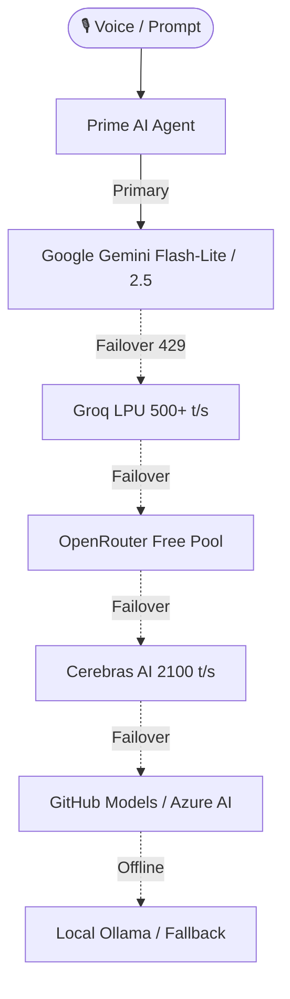

# ⚡ PRIME AI :: AUTONOMOUS NEURAL DESKTOP OPERATING SYSTEM
> **[ Zero GUI · 24/7 Hands-Free Ambient Voice · Deep OS Dominion · Multi-Brain Failover · Karpathy-Standard Coder ]**  
> *Engineered for Pratik Thorat (`thoratpratik2323-hue`)*

[](https://microsoft.com)
[](https://python.org)
[](https://github.com/thoratpratik2323-hue/prime-II1)
[](https://aistudio.google.com)
[](https://groq.com)
[](https://github.com/thoratpratik2323-hue/prime-II1)
[](https://github.com/thoratpratik2323-hue/prime-II1)

---

## 🌟 Executive Overview

**PRIME AI** is an autonomous, headless, voice-first digital desktop operating intelligence. It gives you 100% complete hands-free dominion over your Windows PC without touching a mouse or keyboard.

From typing code, clicking buttons, controlling browsers, and managing files, to zero-fail WhatsApp messaging, Obsidian Second Brain indexing, and multimodal AI screen vision—Prime handles it in real time while you speak naturally in **Hinglish** or **English**.

```
              ██████╗ ██████╗ ██╗███╗   ███╗███████╗     █████╗ ██╗
              ██╔══██╗██╔══██╗██║████╗ ████║██╔════╝    ██╔══██╗██║
              ██████╔╝██████╔╝██║██╔████╔██║█████╗      ███████║██║
              ██╔═══╝ ██╔══██╗██║██║╚██╔╝██║██╔══╝      ██╔══██║██║
              ██║     ██║  ██║██║██║ ╚═╝ ██║███████╗    ██║  ██║██║
              ╚═╝     ╚═╝  ╚═╝╚═╝╚═╝     ╚═╝╚══════╝    ╚═╝  ╚═╝╚═╝
  ⚡ AUTONOMOUS NEURAL COCKPIT :: ZERO GUI · 24/7 AMBIENT VOICE · PURE POWER
```

---

## 🔥 Recent Major Upgrades

### 1. 🎙️ Brian Multilingual Neural & Smart Bilingual Voice Switcher
- **Modern AI Companion Voice:** Default spoken voice upgraded to **`en-US-BrianMultilingualNeural`** with speech rate boosted to **`+22%`** for crisp, natural, energetic delivery.
- **Automatic Hindi & Hinglish Routing:** Uses `is_hindi_or_hinglish()` to dynamically route Devanagari Hindi or Hinglish phrases (*e.g. "bhai message bhej de", "kya chal raha hai", "namaste"*) directly to **`hi-IN-MadhurNeural`**, ensuring native Indian pronunciation without western accent distortion.

### 2. 💬 Zero-Fail WhatsApp Automation Engine
- **Desktop Isolation Bypass:** Background tasks operate in `WinSta0\exebox`. Prime's new `run_on_interactive_thread()` attaches a dedicated worker thread directly to the physical display station (`WinSta0\Default`).
- **Foreground Activation Lock Break:** Uses `EnumDesktopWindows` via native `user32.dll` combined with `AttachThreadInput` to forcefully bring active WhatsApp windows (Chrome WhatsApp Web or Desktop App) to the foreground.
- **Dual Hardware Enter Dispatch:** Automatically simulates physical scan-code `0x0D` and `pyautogui.press('enter')` to reliably dispatch messages.
- **Address Book Sync:** Loaded and fuzzy searches across **115+ contacts** synced from `contacts.vcf`.

### 3. 📐 Karpathy-Inspired Coding Guidelines (`CLAUDE.md`)
Derived from [Andrej Karpathy's observations](https://github.com/multica-ai/andrej-karpathy-skills) on LLM coding pitfalls, Prime AI's core developer personality (`ai_agent.py` and `claw_developer.py`) strictly enforces:
1. **Think Before Coding:** Explicitly surface assumptions, present interpretations, and push back if a simpler design exists.
2. **Simplicity First:** Write the minimum code that solves the problem. No speculative abstractions, unrequested flexibility, or bloated boilerplate.
3. **Surgical Changes:** Touch only the exact lines that must change. Match existing style. Never modify unbroken code or unrelated comments.
4. **Goal-Driven Execution:** Transform tasks into verifiable test criteria (reproduce bug → fix → verify test passes).

### 4. 👥 279 Agency Specialist Agents & Personas
Integrated with the complete Agency Agent Roster (`agency_roster.py`), allowing Prime to dynamically morph into:
- **Engineering (39):** Backend Architect, Frontend Developer, DevOps Automator, SRE, Rust Specialist, etc.
- **Security (14):** Penetration Tester, AppSec Engineer, Cloud Security Architect, Blockchain Auditor.
- **Geospatial & GIS (32):** Web GIS Developer, Cartography Designer, Geoprocessing Specialist, Spatial Data Scientist.
- **Marketing & Social (17):** Growth Hacker, SEO Specialist, Social Media Strategist, Twitter/X Intelligence.
- **Design & UI/UX (16):** UI Designer, UX Architect, Whimsy Injector, Brand Guardian.
- **Testing & QA (6):** Test Automation Engineer, Evidence Collector, API Tester, Reality Checker.

### 5. 🧪 Comprehensive Test Suite (66 Passing Tests)
Includes [`tests/test_prime_full_system.py`](tests/test_prime_full_system.py) which verifies:
- Core configuration, single-instance mutex, and provider fallback ladders.
- Spoken voice bilingual routing and speech rates.
- WhatsApp phone normalization and interactive thread dispatch.
- All 73 tool specifications and executable handlers.
- Obsidian RAG Second Brain read/write capabilities.
- 279 agency skills and intent router classification (<1ms fast-path).
- Self-healing diagnostic audit (status: `HEALTHY`, 6/6 sub-tests passed in 9.82ms).

---

## 🚀 Key Architectural Pillars

### 1. 🎙️ 24/7 Ambient Listening & Smart Hardware Mic
- **Always-On Open Mic:** Hands-free background listening with high-sensitivity Speech Recognition tuned for Indian English & Hinglish (`en-IN`).
- **Headset Auto-Detection:** Automatically spots active Bluetooth headsets (e.g. `FT_38102_4268 Hands-Free`) to prevent internal microphone deadness.
- **Faster-Whisper Offline Fallback:** Local offline STT when internet is unavailable.

### 2. 🧠 Multi-Brain Intelligent Failover Ladder
Prime never goes down. If one API hits rate limits (HTTP 429) or quota exhaustion, the neural switcher automatically cascades to the next best provider:


### 3. 🖱️ Complete Windows OS Dominion (73 Native Tools)
Prime interacts with Windows exactly like a human engineer:
- **Mouse Control:** `mouseClick(x, y, button, clicks)`, `mouseMove(x, y, duration)`, `mouseScroll(clicks)`, `getCursorPosition()`
- **Keyboard Execution:** `typeText(text, interval)`, `pressHotkey(keys)` (`["ctrl", "c"]`, `["alt", "tab"]`, `["win", "d"]`)
- **Multimodal Screen Vision:** `analyzeScreenWithAI(prompt)` captures real-time high-res screen state and feeds it to Gemini Vision to inspect windows, errors, or websites.
- **Shell & PowerShell:** `executePowerShell(command)`, `openPath(path)`, `listDrives()`, `manageProcess(action, name_or_pid)`.
- **Window Management:** `listOpenWindows()`, `focusWindow(title)`.

### 4. 👁️ Ambient Vision & Spatial Awareness
- **Real-Time Multimodal Workflow Tracking:** Continuously perceives the operator's desktop workspace without waiting for one-off commands.
- **Stuck & Error Sentinel:** Automatically detects recurring compiler errors (`SyntaxError`, `npm ERR!`, `TypeError`, stack traces) or prolonged visual stagnation on code (> 4 min).
- **Proactive Multimodal Interventions:** Offers intelligent diagnostics and automated code fixes right when you hit a wall.

### 5. 🔮 Deep Predictive Context & Anticipatory Memory
- **Codebase Anticipation:** Detects when you switch projects in VS Code or Terminal, automatically inferring the tech stack (Node, Python, Rust, Flutter), git branch, and recent commits.
- **Instant Pre-fetching:** Pre-loads project architecture and related Obsidian documentation into working memory before you even ask.
- **Autonomous Obsidian Thought Crystallization:** Synthesizes daily milestones, solved issues, and learned lessons directly into `Obsidian_Vault/Daily_Notes/YYYY-MM-DD.md`.

### 6. 🌐 Seamless Cross-Device Omnipresence (Neural Mesh Bridge)
- **Unified Neural Mesh:** Securely bridges your Windows PC with your mobile smartphone and tablet via local LAN.
- **Bidirectional Clipboard Sync:** Copies on your phone appear instantly on PC clipboard, and vice versa.
- **Real-time SSE Notification Stream:** Pushes build completions, stuck alerts, and system vitals straight to your phone.
- **Remote Mobile Cockpit:** Speak to Prime from anywhere in your home, trigger hardware quick actions (Lock PC, Mute, Play/Pause, Live Screen Preview).

### 7. 🧬 Autonomous Self-Healing & Code Evolution
- **Continuous System Health Audit:** Runs automated self-diagnostic suites across tool dispatch, plugin caches, SQLite knowledge graph, execution traces, and LLM providers.
- **Autonomous Error Isolation & Patching:** Detects recurring tool failures and auto-heals directory anomalies or missing resources.
- **Runtime Performance Self-Tuning:** Auto-compacts trace logs (> 2MB) and optimizes plugin discovery to maintain sub-0.05s response times.

### 8. 🛡️ Windows Single-Instance Mutex & 24/7 Always-On Power State
- **No Duplicate Instances:** Protected by Windows Kernel Named Mutex (`Global\PrimeAI_SingleInstance_Mutex`).
- **24/7 Always-On Power:** Prevents Windows sleep/hibernate while on AC power (`ES_CONTINUOUS | ES_SYSTEM_REQUIRED | ES_AWAYMODE_REQUIRED`).

---

## 🛠️ Complete 73-Tool Arsenal

| Category | Tools & Capabilities |
| :--- | :--- |
| **System & Power** | `getCurrentTime`, `systemInfo`, `gpuInfo`, `listDrives`, `manageProcess`, `volumeUp`, `volumeDown`, `setVolume`, `muteToggle`, `enableAutoStart`, `disableAutoStart`, `getAutoStartStatus` |
| **Desktop & Window Management** | `openApplication`, `closeApplication`, `minimizeWindow`, `maximizeWindow`, `closeWindow`, `switchApplication`, `listOpenWindows`, `focusWindow`, `getCursorPosition`, `operatorControl`, `openPath` |
| **Keyboard & Mouse** | `mouseClick`, `mouseMove`, `mouseScroll`, `typeText`, `pressHotkey`, `getClipboard`, `pasteClipboard`, `clearClipboard` |
| **Files & Workspace** | `createFile`, `readFile`, `listFiles`, `searchFiles`, `openFolder`, `deleteFile`, `createPythonFile`, `runPythonScript`, `exportWorkspaceZip` |
| **Web & Search** | `openWebsite`, `searchWeb`, `searchGoogle`, `searchYouTube`, `searchGitHub`, `getWeather` |
| **Vision & Screen** | `takeScreenshot`, `saveScreenshot`, `readScreen`, `analyzeScreenWithAI`, `ambientVisionInspect` |
| **Developer Automation (Claw Code)** | `runTerminalCommand`, `patchCodeFile`, `gitAutomate`, `runUnitTests`, `debugCodeFile`, `executePowerShell`, `exportProjectStarter` |
| **Obsidian Second Brain** | `searchObsidianNotes`, `readObsidianNote`, `writeObsidianNote`, `quickNote`, `morningBriefing` |
| **Media & IoT** | `mediaControl`, `spotifyControl`, `neuralMeshPair`, `selfHealingAudit` |
| **WhatsApp Automation** | `sendWhatsAppMessage`, `saveWhatsAppContact`, `listWhatsAppContacts`, `setupWhatsAppWeb`, `readWhatsAppChats`, `importWhatsAppContacts` |

---

## ⚙️ Configuration & Environment (.env)

All credentials are kept secure in `.env` (gitignored):

```env
# 1. Primary AI Brain (Google AI Studio)
GEMINI_API_KEY=AIzaSy...

# 2. Ultra-Fast LPU Failover (Groq Console)
GROQ_API_KEY=gsk_...

# 3. Aggregator & Free Models (OpenRouter)
OPENROUTER_API_KEY=sk-or-v1-...

# 4. Ultra-Speed Inference (Cerebras Cloud)
CEREBRAS_API_KEY=csk-...

# 5. GitHub Personal Access Token (PAT)
GITHUB_TOKEN=github_pat_...

# Provider & Audio Setup
AI_PROVIDER=auto
AI_MODEL=gemini-flash-lite-latest
VOICE_OUTPUT=true
TTS_VOICE=en-US-BrianMultilingualNeural
VOICE_RATE=+22%
VOICE_VOLUME=1.0
REQUIRE_WAKE_WORD=false
```

---

## 💻 How to Run

### 1. Installation
Install core dependencies using `requirements.txt`:
```cmd
pip install -r requirements.txt
```

### 2. Silent Ambient Background Mode
Double-click `start-prime-background.vbs`. Prime runs silently in the background with ambient voice listening enabled.

### 3. Interactive Neural Terminal Cockpit
Run via Command Prompt or PowerShell:
```cmd
start-prime.bat
```
or:
```cmd
python prime.py
```

### 4. Run Test Suites
To verify security guardrails, all 73 tools, voice routing, WhatsApp, and agency skills:
```cmd
python tests/test_security_guards.py
python tests/test_prime_full_system.py
```

### 5. CLI Commands & Hub
Inside the cockpit:
- `Type any prompt` — Talk directly to Prime
- `/v` or `/mic` — Toggle microphone
- `/menu` — Open full interactive system control hub
- `/providers` — View all 10+ live LLM provider connections and latency
- `/briefing` — Generate instant on-demand daily digest
- `/system` — Real-time CPU, RAM, Disk, and Battery telemetry
- `/status` — Complete neural core diagnostic overview

---

## 🔒 Security & Defense-in-Depth

Prime AI incorporates enterprise-grade security guardrails against arbitrary code execution (RCE) and destructive system commands:

- **Zero-Eval Architecture (`AST` Parsers):**
  - Eliminated unsafe `eval()` and pseudo-sandboxed `exec()` across the codebase (`actions/safe_code_executor.py`, `actions/workflow_engine.py`, `actions/autonomous_autopilot.py`, and `actions/desktop.py`).
  - Mathematical calculations and workflow conditions are evaluated strictly via Abstract Syntax Tree traversal without permitting Python attribute-chain escapes (`__subclasses__`).
- **PowerShell Guardrails:**
  - `executePowerShell` blocks dangerous commands attempting disk formatting (`format C:`), recursive Windows deletion, Defender tampering (`Set-MpPreference -DisableRealtimeMonitoring`), or shadow copy deletion (`vssadmin`).
- **Core System Process Armor:**
  - `manageProcess` refuses to terminate critical Windows kernel/subsystem processes (`csrss.exe`, `lsass.exe`, `services.exe`, `smss.exe`, `svchost.exe`, `winlogon.exe`).
- **Protected File System Roots:**
  - File operations (`deletePath`, `createFile`, `writeTextToFile`) reject operations targeting Windows system paths (`C:\Windows`, `C:\Program Files`, root `C:\`) even if bypass flags (`allow_anywhere=True`) are specified.
- **Strict Credential Quarantine:**
  - All API keys, environment files, and secret patterns are locked under `.gitignore`. No credentials ever leak to source control.
- **Kernel Mutex Lock:** Guards against duplicate process instances, race conditions, and audio stream hijacking.

---

<p align="center">
  <b>Built with ⚡ by Pratik Thorat · Prime Autonomous Intelligence</b>
</p>
