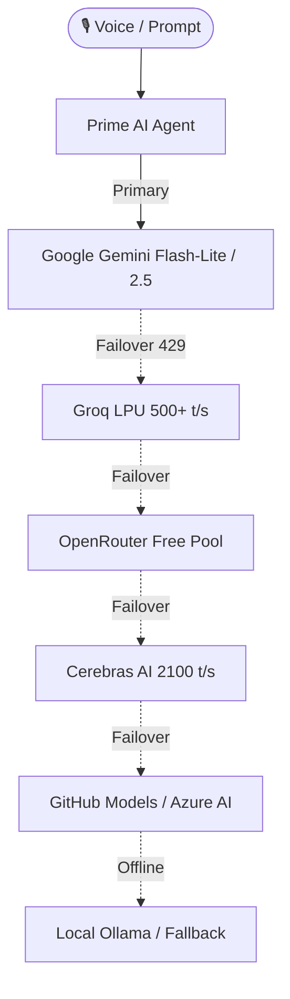

# ⚡ PRIME AI :: AUTONOMOUS NEURAL DESKTOP OPERATING SYSTEM
> **[ Zero GUI · 24/7 Hands-Free Ambient Voice · Deep OS Dominion · Multi-Brain Failover · Karpathy-Standard Coder ]**  
> *Engineered for Pratik Thorat (`thoratpratik2323-hue`)*

[](https://microsoft.com)
[](https://python.org)
[-brightgreen?style=for-the-badge&logo=pytest)](https://github.com/thoratpratik2323-hue/prime-II1)
[](https://aistudio.google.com)
[](https://groq.com)
[](https://github.com/thoratpratik2323-hue/prime-II1)
[](https://github.com/thoratpratik2323-hue/prime-II1)
[](https://github.com/thoratpratik2323-hue/prime-II1)

---

## 🌟 Executive Overview

**PRIME AI** is an autonomous, headless, voice-first digital desktop operating intelligence. It gives you 100% complete hands-free dominion over your Windows PC without touching a mouse or keyboard.

From typing code, clicking buttons, controlling browsers, and managing files, to zero-fail WhatsApp messaging, Obsidian Second Brain indexing, and multimodal AI screen vision—Prime handles it in real time while you speak naturally in **Hinglish** or **English**.

```
              ██████╗ ██████╗ ██╗███╗   ███╗███████╗     █████╗ ██╗
              ██╔══██╗██╔══██╗██║████╗ ████║██╔════╝    ██╔══██╗██║
              ██████╔╝██████╔╝██║██╔████╔██║█████╗      ███████║██║
              ██╔═══╝ ██╔══██╗██║██║╚██╔╝██║██╔══╝      ██╔══██║██║
              ██║     ██║  ██║██║██║ ╚═╝ ██║███████╗    ██║  ██║██║
              ╚═╝     ╚═╝  ╚═╝╚═╝╚═╝     ╚═╝╚══════╝    ╚═╝  ╚═╝╚═╝
  ⚡ AUTONOMOUS NEURAL COCKPIT :: ZERO GUI · 24/7 AMBIENT VOICE · PURE POWER
```

---

## 🔥 Recent Major Upgrades

### 1. 🎙️ Brian Multilingual Neural & Zero-Gap Continuous Voice (+28% Rate)
- **High-Velocity AI Voice:** Spoken voice upgraded to **`en-US-BrianMultilingualNeural`** with accelerated speech rate at **`+28%`** for crisp, instantaneous, human-like cadence without latency.
- **Zero-Gap Continuous Audio Streaming:** Replaced segmented per-sentence TTS file generation with single-pass continuous audio synthesis and atomic buffer playback, completely eliminating the 2–3 second dead pauses between sentences.
- **Automatic Hindi & Hinglish Routing:** Uses `is_hindi_or_hinglish()` to dynamically route Devanagari Hindi or Hinglish phrases (*e.g. "bhai message bhej de", "kya chal raha hai", "namaste"*) directly to **`hi-IN-MadhurNeural`**, ensuring native Indian pronunciation without western accent distortion.

### 2. 🏢 Munder Difflin Suite: 2D Pixel Office Floor, Stigmergy Mailbox & Global Dictation
- **2D Virtual Pixel Office Floor Canvas:** Visual HTML5/JS real-time canvas hosted at `http://localhost:8765/office` (API: `/api/office/state`). Tracks 8 autonomous AI staff members (Prime, Dwight, Jim, Pam, Michael, Angela, Kevin, Creed) with stateful mood, workstation coordinates, task status, and real-time state API.
- **Asynchronous Mailbox Stigmergy Protocol (`core/dots_mailbox.py`):** Decentralized file-based message queues (`inbox/`, `outbox/`, `.sent/`, `.done/`) with JSON payloads and flying envelope animations across desks. Fully hardened with Windows atomic writes and retry locks.
- **System-Wide Instant Voice Dictation ("Stapler Dictation"):** Global hotkey `Ctrl + Alt + Space` with Win32 low-level message pump. Listens for speech, automatically transcribes via Groq Whisper, and pastes into any active cursor/focused window with clipboard preservation and retry logic.
- **Voice-First HITL Approval Gatekeeper:** Real-time conversational gate for critical and high-risk system commands (`"approve"`, `"yes approve"`, `"reject"`, `"cancel that"`), preventing accidental destructive operations.

### 3. ⚡ Instant Groq LPU Failover (<0.4s) & Fast Browser Navigation
- **Ultra-Fast LLM Circuit Breaker:** Aggressive 4.5s timeout on primary Gemini API calls. Instant 60-second backoff circuit breaker activates immediately upon encountering HTTP 503 (Overloaded) or HTTP 429 (Quota Exhaustion).
- **Sub-Second Groq Execution:** Seamlessly falls back to Groq's LPU running `openai/gpt-oss-120b` (average **~0.38s** execution), ensuring zero user downtime during Google AI Studio rate spikes.
- **Fast Navigation Path:** Natural language browser navigation (*"navigate to youtube.com"*, *"go to github.com"*, *"open reddit"*) is intercepted via compiled regex patterns and executed directly in milliseconds without round-trip LLM latency.

### 4. 💬 Zero-Fail WhatsApp Automation Engine & Full Calling Suite
- **Desktop Isolation Bypass:** Background tasks operate in `WinSta0\exebox`. Prime's `run_on_interactive_thread()` attaches a dedicated worker thread directly to the physical display station (`WinSta0\Default`).
- **Foreground Activation Lock Break:** Uses `EnumDesktopWindows` via native `user32.dll` combined with `AttachThreadInput` to forcefully bring active WhatsApp windows (Chrome WhatsApp Web or Desktop App) to the foreground.
- **Voice & Video Calling Suite:** 
  - Make outgoing voice or video calls (`makeWhatsAppCall`, e.g. *"WhatsApp call lagao Mummy ko"* or *"Video call Rohit"*).
  - Call pickup / answer (`acceptWhatsAppCall`, e.g. *"Call pickup karo"* / *"Phone uthao"* via `Alt+A` / UI Automation).
  - Call decline / reject (`rejectWhatsAppCall`, e.g. *"Call reject karo"* / *"Phone cut karo"* via `Alt+D` / UI Automation).
  - Hang up active call (`endWhatsAppCall`, e.g. *"Call kaat do"* / *"Disconnect call"*).
  - Mute / Unmute microphone (`toggleWhatsAppCallMute`, e.g. *"Mute kar do"* / `Ctrl+Shift+M`).
- **Natural Language Call Scheduler:**
  - Schedule WhatsApp calls (`scheduleWhatsAppCall`, e.g. *"10 minute baad Rohit ko call lagana"*, *"5 baje call schedule karo"*).
  - Persistent storage in `data/scheduled_calls.json` with background daemon checking every 5 seconds.
  - Spoken voice alert reminder and automatic dialer trigger when the scheduled time arrives.
  - View and cancel scheduled calls (`listScheduledWhatsAppCalls`, `cancelScheduledWhatsAppCall`).
- **Dual Hardware Enter Dispatch:** Automatically simulates physical scan-code `0x0D` and `pyautogui.press('enter')` to reliably dispatch messages.
- **Address Book Sync:** Loaded and fuzzy searches across **115+ contacts** synced from `contacts.vcf`.

### 5. 🛡️ Windows Concurrency Armor & Error Hardening
- **Zero OS Descriptor Leaks:** Replaced bare `tempfile.mkstemp` usages with `os.close(fd)` cleanup wrappers, preventing file-handle exhaustion under heavy asynchronous mailbox loads.
- **Windows File Lock Defense:** Implemented exponential backoff and retry decorators (`_atomic_write_json`, `_safe_read_json`) across file operations to prevent `[WinError 32]` sharing violations.
- **Pygame Audio Mixer Immunity:** Added strict null-checks (`channel is not None`) in `voice_engine.py` preventing unhandled exceptions when hardware audio devices are busy.
- **Thread-Isolated Clipboard Access:** Protected clipboard readers and writers with retry loops and guaranteed `finally: CloseClipboard()` guarantees.
- **Safe Tool Payload Serialization:** Reinforced all LLM tool calls with `json.dumps(..., default=str)` preventing runtime serialization crashes on non-primitive objects.

### 6. 📐 Karpathy-Inspired Coding Guidelines (`CLAUDE.md`)
Derived from [Andrej Karpathy's observations](https://github.com/multica-ai/andrej-karpathy-skills) on LLM coding pitfalls, Prime AI's core developer personality (`ai_agent.py` and `claw_developer.py`) strictly enforces:
1. **Think Before Coding:** Explicitly surface assumptions, present interpretations, and push back if a simpler design exists.
2. **Simplicity First:** Write the minimum code that solves the problem. No speculative abstractions, unrequested flexibility, or bloated boilerplate.
3. **Surgical Changes:** Touch only the exact lines that must change. Match existing style. Never modify unbroken code or unrelated comments.
4. **Goal-Driven Execution:** Transform tasks into verifiable test criteria (reproduce bug → fix → verify test passes).

### 7. 👥 279 Agency Specialist Agents & Personas
Integrated with the complete Agency Agent Roster (`agency_roster.py`), allowing Prime to dynamically morph into:
- **Engineering (39):** Backend Architect, Frontend Developer, DevOps Automator, SRE, Rust Specialist, etc.
- **Security (14):** Penetration Tester, AppSec Engineer, Cloud Security Architect, Blockchain Auditor.
- **Geospatial & GIS (32):** Web GIS Developer, Cartography Designer, Geoprocessing Specialist, Spatial Data Scientist.
- **Marketing & Social (17):** Growth Hacker, SEO Specialist, Social Media Strategist, Twitter/X Intelligence.
- **Design & UI/UX (16):** UI Designer, UX Architect, Whimsy Injector, Brand Guardian.
- **Testing & QA (6):** Test Automation Engineer, Evidence Collector, API Tester, Reality Checker.

### 8. 🧪 Comprehensive 22-Suite Test Matrix (285+ Passing Tests · 100% Green)
Verified through automated test runner across **22 distinct test suites** executed in ~9.0 seconds:
- `test_security_guards.py` — RCE prevention, AST evaluator, protected system roots, blocked imports.
- `test_prime_full_system.py` — Core configuration, named mutex, and provider fallback ladders.
- `test_feature_matrix.py` — Comprehensive matrix of all system, OS, and tool integrations.
- `test_fast_failover.py` — 4.5s timeout, 60s backoff circuit breaker, and Groq fallback verification.
- `test_munder_difflin_features.py` — 2D Office Floor, Stigmergy Mailbox, Stapler Dictation, and HITL gate.
- `test_ported_features.py` — Ported actions, UI automation, and window lifecycle.
- `test_voice_bilingual_features.py` — Edge-TTS +28% rate calculation, Madhur Hindi & Brian English routing.
- `test_voice_barge_in.py` — Full-duplex speech interruption keyword interception (`voice.barge_in()`).
- `test_voice_cloning.py` — Instant voice cloning profiles, TTS synthesis, and audio cleanup.
- `test_whatsapp_voice_video_calling.py` — WhatsApp voice/video calling, mute, and contact synchronization.
- `test_whatsapp_voicemail_autoresponder.py` — DND focus mode, automated voicemail, and audio transcription.
- `test_multimodal_ambient_features.py` — Real-time workspace inspection and stuck-code detection.
- `test_git_sentinel_features.py` — Autonomous syntax/secrets pre-commit audits and PR summaries.
- `test_daily_briefing_features.py` — Autonomous morning standups and evening debriefs.
- `test_smart_hardware_features.py` — Hardware thermal, battery telemetry, and dynamic power profiling.
- `test_terminal_sentinel_features.py` — Proactive terminal error interception and self-healing.
- `test_remote_mesh_features.py` — Neural Mesh LAN link, Telegram bridge, and authenticated remote control.
- `test_predictive_context_features.py` — Tech stack detection, git anticipation, and Obsidian crystallization.
- `test_clipboard_explainer_features.py` — Snippet classification (JSON/Traceback/Python/URL) and formatting.
- `test_agency_specialists_features.py` — 279 agency specialist personas and <1ms routing.
- `test_safe_code_executor.py` — AST-based mathematical evaluation and single-use confirmation tokens.
- `test_self_healing_features.py` — Automated system health diagnostics and log compaction.

---

## 🚀 Key Architectural Pillars

### 1. 🎙️ 24/7 Ambient Listening & Smart Hardware Mic
- **Always-On Open Mic:** Hands-free background listening with high-sensitivity Speech Recognition tuned for Indian English & Hinglish (`en-IN`).
- **Headset Auto-Detection:** Automatically spots active Bluetooth headsets (e.g. `FT_38102_4268 Hands-Free`) to prevent internal microphone deadness.
- **Faster-Whisper Offline Fallback:** Local offline STT when internet is unavailable.

### 2. 🧠 Multi-Brain Intelligent Failover Ladder
Prime never goes down. If one API hits rate limits (HTTP 429) or quota exhaustion, the neural switcher automatically cascades to the next best provider:

```mermaid
graph TD
    User([🎙️ Voice / Prompt]) --> Core[Prime AI Agent]
    Core -->|Primary| G[Google Gemini Flash-Lite / 2.5]
    G -.->|Failover 429| Q[Groq LPU 500+ t/s]
    Q -.->|Failover| OR[OpenRouter Free Pool]
    OR -.->|Failover| C[Cerebras AI 2100 t/s]
    C -.->|Failover| GH[GitHub Models / Azure AI]
    GH -.->|Offline| L[Local Ollama / Fallback]
```

### 3. 🖱️ Complete Windows OS Dominion (81 Native Tools)
Prime interacts with Windows exactly like a human engineer:
- **WhatsApp Calling & Messaging:** `makeWhatsAppCall`, `acceptWhatsAppCall`, `rejectWhatsAppCall`, `endWhatsAppCall`, `toggleWhatsAppCallMute`, `scheduleWhatsAppCall`, `listScheduledWhatsAppCalls`, `cancelScheduledWhatsAppCall`, `sendWhatsAppMessage`, `listWhatsAppContacts`.
- **Mouse Control:** `mouseClick(x, y, button, clicks)`, `mouseMove(x, y, duration)`, `mouseScroll(clicks)`, `getCursorPosition()`.
- **Keyboard Execution:** `typeText(text, interval)`, `pressHotkey(keys)` (`["ctrl", "c"]`, `["alt", "tab"]`, `["win", "d"]`).
- **Multimodal Screen Vision:** `analyzeScreenWithAI(prompt)` captures real-time high-res screen state and feeds it to Gemini Vision to inspect windows, errors, or websites.
- **Shell & PowerShell:** `executePowerShell(command)`, `openPath(path)`, `listDrives()`, `manageProcess(action, name_or_pid)`.
- **Window Management:** `listOpenWindows()`, `focusWindow(title)`.

### 4. 👁️ Ambient Vision & Spatial Awareness
- **Real-Time Multimodal Workflow Tracking:** Continuously perceives the operator's desktop workspace without waiting for one-off commands.
- **Stuck & Error Sentinel:** Automatically detects recurring compiler errors (`SyntaxError`, `npm ERR!`, `TypeError`, stack traces) or prolonged visual stagnation on code (> 4 min).
- **Proactive Multimodal Interventions:** Offers intelligent diagnostics and automated code fixes right when you hit a wall.

### 5. 🔮 Deep Predictive Context & Anticipatory Memory
- **Codebase Anticipation:** Detects when you switch projects in VS Code or Terminal, automatically inferring the tech stack (Node, Python, Rust, Flutter), git branch, and recent commits.
- **Instant Pre-fetching:** Pre-loads project architecture and related Obsidian documentation into working memory before you even ask.
- **Autonomous Obsidian Thought Crystallization:** Synthesizes daily milestones, solved issues, and learned lessons directly into `Obsidian_Vault/Daily_Notes/YYYY-MM-DD.md`.

### 6. 🌐 Seamless Cross-Device Omnipresence (Neural Mesh Bridge)
- **Unified Neural Mesh:** Securely bridges your Windows PC with your mobile smartphone and tablet via local LAN.
- **Bidirectional Clipboard Sync:** Copies on your phone appear instantly on PC clipboard, and vice versa.
- **Real-time SSE Notification Stream:** Pushes build completions, stuck alerts, and system vitals straight to your phone.
- **Remote Mobile Cockpit:** Speak to Prime from anywhere in your home, trigger hardware quick actions (Lock PC, Mute, Play/Pause, Live Screen Preview).

### 7. 🧬 Autonomous Self-Healing & Code Evolution
- **Continuous System Health Audit:** Runs automated self-diagnostic suites across tool dispatch, plugin caches, SQLite knowledge graph, execution traces, and LLM providers.
- **Autonomous Error Isolation & Patching:** Detects recurring tool failures and auto-heals directory anomalies or missing resources.
- **Runtime Performance Self-Tuning:** Auto-compacts trace logs (> 2MB) and optimizes plugin discovery to maintain sub-0.05s response times.

### 8. 🛡️ Windows Single-Instance Mutex & 24/7 Always-On Power State
- **No Duplicate Instances:** Protected by Windows Kernel Named Mutex (`Global\PrimeAI_SingleInstance_Mutex`).
- **24/7 Always-On Power:** Prevents Windows sleep/hibernate while on AC power (`ES_CONTINUOUS | ES_SYSTEM_REQUIRED | ES_AWAYMODE_REQUIRED`).

---

## 🛠️ Complete Native Tool Arsenal

| Category | Tools & Capabilities |
| :--- | :--- |
| **Munder Difflin & Multi-Agent Swarm** | `dotsMailboxSend`, `dotsMailboxCheck`, `staplerDictate`, `officeFloorState` |
| **System & Power Management** | `getCurrentTime`, `systemInfo`, `gpuInfo`, `listDrives`, `manageProcess`, `volumeUp`, `volumeDown`, `setVolume`, `muteToggle`, `enableAutoStart`, `disableAutoStart`, `getAutoStartStatus`, `getHardwareHealthAudit`, `setPowerProfile` |
| **Desktop & Window Management** | `openApplication`, `closeApplication`, `minimizeWindow`, `maximizeWindow`, `closeWindow`, `switchApplication`, `listOpenWindows`, `focusWindow`, `getCursorPosition`, `operatorControl`, `openPath` |
| **Keyboard, Mouse & Clipboard** | `mouseClick`, `mouseMove`, `mouseScroll`, `typeText`, `pressHotkey`, `getClipboard`, `pasteClipboard`, `clearClipboard`, `getClipboardHistory`, `explainClipboardSnippet`, `formatClipboardJson` |
| **Files & Workspace Management** | `createFile`, `readFile`, `listFiles`, `searchFiles`, `openFolder`, `deleteFile`, `createPythonFile`, `runPythonScript`, `exportWorkspaceZip` |
| **Web, Search & Weather** | `openWebsite`, `searchWeb`, `searchGoogle`, `searchYouTube`, `searchGitHub`, `getWeather` |
| **Vision, Camera & Screen** | `takeScreenshot`, `saveScreenshot`, `readScreen`, `analyzeScreenWithAI`, `ambientVisionInspect` |
| **Developer Automation & Healing** | `runTerminalCommand`, `patchCodeFile`, `gitAutomate`, `runUnitTests`, `debugCodeFile`, `executePowerShell`, `exportProjectStarter`, `interceptTerminalError`, `gitPreCommitAudit`, `gitSafeCommit`, `generatePRSummary` |
| **Obsidian Second Brain & Vector Memory** | `searchObsidianNotes`, `searchSecondBrainSemantic`, `crystallizeDevLog`, `readObsidianNote`, `writeObsidianNote`, `quickNote`, `morningBriefing`, `generateMorningStandup`, `generateEveningDebrief` |
| **Media, IoT & Out-of-Home Mesh** | `mediaControl`, `spotifyControl`, `neuralMeshPair`, `selfHealingAudit`, `sendRemoteAlert` |
| **WhatsApp Calling, Messaging & Voicemail** | `makeWhatsAppCall`, `acceptWhatsAppCall`, `rejectWhatsAppCall`, `endWhatsAppCall`, `toggleWhatsAppCallMute`, `scheduleWhatsAppCall`, `scheduleRecurringWhatsAppCall`, `listScheduledWhatsAppCalls`, `cancelScheduledWhatsAppCall`, `transcribeWhatsAppAudio`, `sendWhatsAppMessage`, `saveWhatsAppContact`, `listWhatsAppContacts`, `setupWhatsAppWeb`, `readWhatsAppChats`, `importWhatsAppContacts`, `enableDNDMode`, `disableDNDMode`, `getWhatsAppCallLogs` |

---

## ⚙️ Configuration & Environment (.env)

All credentials are kept secure in `.env` (gitignored):

```env
# 1. Primary AI Brain (Google AI Studio)
GEMINI_API_KEY=AIzaSy...

# 2. Ultra-Fast LPU Failover (Groq Console)
GROQ_API_KEY=gsk_...

# 3. Aggregator & Free Models (OpenRouter)
OPENROUTER_API_KEY=sk-or-v1-...

# 4. Ultra-Speed Inference (Cerebras Cloud)
CEREBRAS_API_KEY=csk-...

# 5. GitHub Personal Access Token (PAT)
GITHUB_TOKEN=github_pat_...

# Provider & Audio Setup
AI_PROVIDER=auto
AI_MODEL=gemini-flash-lite-latest
VOICE_OUTPUT=true
TTS_VOICE=en-US-BrianMultilingualNeural
VOICE_RATE=+28%
VOICE_VOLUME=1.0
REQUIRE_WAKE_WORD=false
```

---

## 💻 How to Run

### 1. Installation
Install core dependencies using `requirements.txt`:
```cmd
pip install -r requirements.txt
```

### 2. Silent Ambient Background Mode
Double-click `start-prime-background.vbs` or run `run_prime.bat`. Prime runs silently in the background with ambient voice listening, WhatsApp monitors, and system sentinels enabled.

### 3. Interactive Neural Terminal Cockpit
Run via Command Prompt or PowerShell:
```cmd
start-prime.bat
```
or:
```cmd
python prime.py
```

### 4. 2D Virtual Office Floor Canvas
Open your browser to view the autonomous multi-agent office in real-time:
```
http://localhost:8765/office
```
Features 8 autonomous agents, desk coordinates, real-time thought bubbles, and flying envelope animations for stigmergy mailbox messages.

### 5. System-Wide Instant Voice Dictation (Stapler)
Press **`Ctrl + Alt + Space`** anywhere on Windows (in VS Code, Slack, Word, or browser) to dictate voice directly into any active input field.

### 6. Run Full 22-Suite Verification Matrix
To execute the complete 22-suite test suite (285+ tests):
```cmd
python -m unittest discover -s tests -p "test_*.py"
```

### 7. CLI Commands & Hub
Inside the cockpit:
- `Type any prompt` — Talk directly to Prime
- `/v` or `/mic` — Toggle microphone
- `/menu` — Open full interactive system control hub
- `/providers` — View all 10+ live LLM provider connections and latency
- `/briefing` — Generate instant on-demand daily digest
- `/system` — Real-time CPU, RAM, Disk, and Battery telemetry
- `/status` — Complete neural core diagnostic overview

---

## 🔒 Security & Defense-in-Depth

Prime AI incorporates enterprise-grade security guardrails against arbitrary code execution (RCE) and destructive system commands:

- **Zero-Eval Architecture (`AST` Parsers):**
  - Eliminated unsafe `eval()` and pseudo-sandboxed `exec()` across the codebase (`actions/safe_code_executor.py`, `actions/workflow_engine.py`, `actions/autonomous_autopilot.py`, and `actions/desktop.py`).
  - Mathematical calculations and workflow conditions are evaluated strictly via Abstract Syntax Tree traversal without permitting Python attribute-chain escapes (`__subclasses__`).
- **PowerShell Guardrails:**
  - `executePowerShell` blocks dangerous commands attempting disk formatting (`format C:`), recursive Windows deletion, Defender tampering (`Set-MpPreference -DisableRealtimeMonitoring`), or shadow copy deletion (`vssadmin`).
- **Core System Process Armor:**
  - `manageProcess` refuses to terminate critical Windows kernel/subsystem processes (`csrss.exe`, `lsass.exe`, `services.exe`, `smss.exe`, `svchost.exe`, `winlogon.exe`).
- **Protected File System Roots:**
  - File operations (`deletePath`, `createFile`, `writeTextToFile`) reject operations targeting Windows system paths (`C:\Windows`, `C:\Program Files`, root `C:\`) even if bypass flags (`allow_anywhere=True`) are specified.
- **Strict Credential Quarantine:**
  - All API keys, environment files, and secret patterns are locked under `.gitignore`. No credentials ever leak to source control.
- **Kernel Mutex Lock:** Guards against duplicate process instances, race conditions, and audio stream hijacking.

---

<p align="center">
  <b>Built with ⚡ by Pratik Thorat · Prime Autonomous Intelligence</b>
</p>
